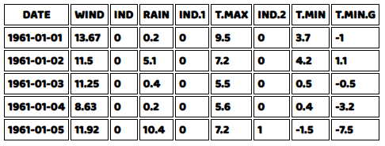
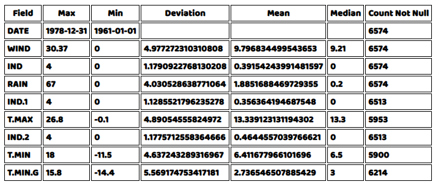
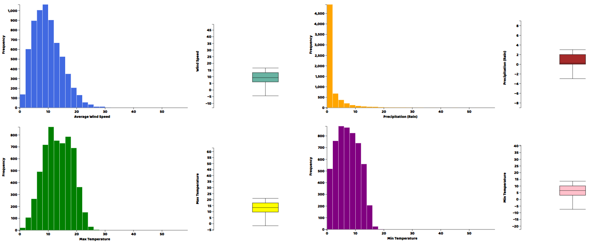
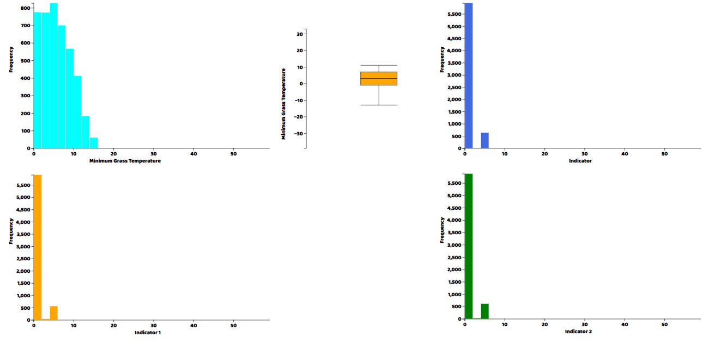
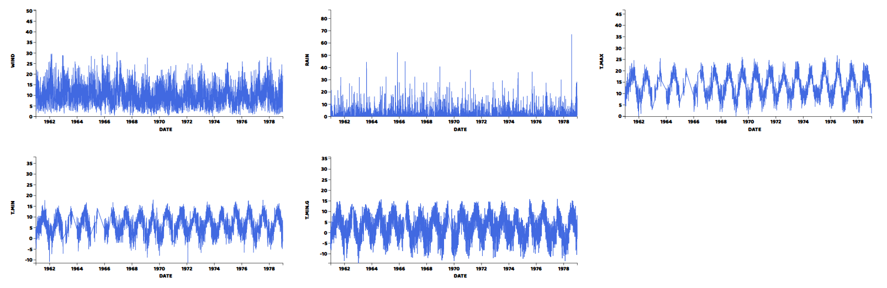
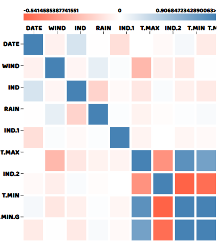

## Visualization of Weather Data with D3.js and GridDB

In this article, we will be looking at how to visualize and analyze weather data using GridDB. We will be loading a dataset available as a CSV file into GridDB, then fetching the data from GridDB and performing data analysis on it. We will be using the Weather Dataset.

## Loading Data into GridDB

```javascript
var griddb = require('griddb_node');
const csv = require('csv-parser');
const fs = require('fs');

const factory = griddb.StoreFactory.getInstance();
const store = factory.getStore({
    "host": '239.0.0.1',
    "port": 31999,
    "clusterName": "defaultCluster",
    "username": "admin",
    "password": "admin"
});
// For connecting to the GridDB Server we have to make containers and specify the schema.
const colConInfo = new griddb.ContainerInfo({
    'name': "Weather",
    'columnInfoList': [
      ["DATE", griddb.Type.DOUBLE],
      ["WIND", griddb.Type.DOUBLE],
      ["IND", griddb.Type.INTEGER],
      ["RAIN", griddb.Type.DOUBLE],
      ["IND.1", griddb.Type.INTEGER],
      ["T.MAX", griddb.Type.DOUBLE],
      ["IND.2", griddb.Type.INTEGER],
      ["T.MIN", griddb.Type.DOUBLE],
      ["T.MIN.G", griddb.Type.DOUBLE]
    ],
    'type': griddb.ContainerType.TIME_SERIES, 'rowKey': true
});

fs.createReadStream('./dataset/windspeed.csv')
  .pipe(csv())
  .on('data', (row) => {
    var col2;
    store.putContainer(conInfo, false)
       .then(col => {
            col2 = col;
           col.createIndex("count", griddb.GS_INDEX_FLAG_DEFAULT);
           return col;
        })
       .then(col => {
           col.setAutoCommit(false);
           col.put([convertDateToTimeStamp(row['DATE']), row['WIND'], row['IND'], row['RAIN'], row['IND.1'], row['T.MAX'], row['IND.2'], row['T.MIN'], row['T.MIN.G']]);
           return col;
       })
  })
  .on('end', () => {
    console.log('CSV file successfully processed');
  });
```
## Fetching Data from GridDB

```javascript
var data = []
store.getContainer("Weather")
       .then(ts => {
       query = ts.query("select * from Weather");
       return query.fetch();
   }).then(rowset => {
       var row;
       while (rowset.hasNext()) {
           row = rowset.next();
           data.push(row);
           }
        )
```

## Data Visualization:

For the purpose of plotting and drawing tables, we will use D3.js, a library that allows manipulation of documents based on data. HTML DOM manipulation and visualization is possible with this library.

We will first start with printing the first few rows of the dataset to get a feel for the data. For this purpose we are going to have to write the code for creating and inserting data into an html table. This is going to be helper code and will be included in the source files, and is beyond the scope of this article.

Once this is done, we can write the code for printing the table.

```javascript
let result = data.flatMap(Object.keys);
result = [...new Set(result)];

tables("data_table",data,result,true)
```

In the code above, result is the array of columns of our data, and "data_table" is the HTML Element ID for the table we are going to insert data into. The last argument is a flag for showing the top 5 rows, which we set to true.

Here we see the result of our code:




Now that we see the kind of data that we have, we would now want to look at a summary of different statistics related to all the numeric columns of our data. We can use the same helper function for the drawing the table to the HTML document, but we will need to write the code for getting all the summarized quantities. We will get the Minimum, Maximum, Deviation, Mean, Median and a Count of rows that are not null in the data. Fortunately D3.js provides functions for most of these, but we will have to create a helper function for the count of not null rows. We can simply write a for loop and increment a value if the row for that column is not null and return the value at the end.

```javascript
const countNotNull = (array) => {
    let count = 0
    for(let i = 0; i < array.length; i++){
        if(isNaN(parseInt(array[i]))==false && array[i]!==null){ count++ }}
    return count
};
```

With that out of the way, we can write the for loop for getting the summary data of our dataset. We are going to use an HTML element with the ID "data_table2" to draw this table.

```javascript
let obj = {}

let summary_data = []
for(let i = 0; i < result.length; i++){
    
    obj[result[i]]  = data.map(function(elem){return elem[result[i]]});
    let count = 0
    let summarize = {}

    if(result[i]!='DATE'){
        obj[result[i]] = obj[result[i]].map(Number)
    }
    summarize['Field'] = result[i]
    summarize['Max'] = d3.max(obj[result[i]])
    summarize['Min'] = d3.min(obj[result[i]])
    summarize['Deviation'] = d3.deviation(obj[result[i]])
    summarize['Mean'] = d3.mean(obj[result[i]])
    summarize['Median'] = d3.median(obj[result[i]])
    
    summarize['Count Not Null'] = countNotNull(obj[result[i]])
    
    summary_data.push(summarize)
}
let result2 = summary_data.flatMap(Object.keys)
result2 = [...new Set(result2)];
tables("data_table2",summary_data,result2,false)
```

The result should be as follows:



Now, we would want to see the actual distributions for each of the columns in the data in the form of histogram and a box plot. Again for both plots we will need to write helper functions, which are provided in the source files. After writing those helper functions, we can call them directly in our main javascript file.

```javascript
## WindSpeed
histogram("my_dataviz",obj['WIND'],'Average Wind Speed')
boxplot("my_dataviz",obj['WIND'],"Wind Speed")

## Precipitation
histogram("my_dataviz2",obj['RAIN'],'Precipitation (Rain)',"orange")
boxplot("my_dataviz2",obj['RAIN'],"Precipitation (Rain)",'brown')

## Max Temperature
histogram("my_dataviz3",obj['T.MAX'],'Max Temperature',"green")
boxplot("my_dataviz3",obj['T.MAX'],"Max Temperature",'yellow')

## Min Temperature
histogram("my_dataviz4",obj['T.MIN'],'Min Temperature',"purple")
boxplot("my_dataviz4",obj['T.MIN'],"Min Temperature",'pink')

## Minimum Grass Temperature
histogram("my_dataviz5",obj['T.MIN.G'],'Minimum Grass Temperature',"cyan")
boxplot("my_dataviz5",obj['T.MIN.G'],"Minimum Grass Temperature",'orange')

## Indicator Variable
histogram("my_dataviz6",obj['IND'],'Indicator')

## Indicator Variable 1
histogram("my_dataviz7",obj['IND.1'],'Indicator 1',"orange")

## Indicator Variable 2
histogram("my_dataviz8",obj['IND.2'],'Indicator 2',"green")
```

In each of these plotting functions, the first argument is the ID of the html element in which we want to draw the plot, then the array of the column of the data we want to plot, then a title and a CSS-compatible color code. We can visualize the results by opening the html file from the web server.





We've had a look at plots for distributions, but since the data is a timeseries, we should also plot its columns against time to visualize the trends and patterns in the data. So now we are going to make a line plot of each of the variables in the dataset. The `lineplot()` function was written by us and is included in the source files.

```javascript
lineplot("my_dataviz9",data,obj,'DATE','WIND','#4169e1')
lineplot("my_dataviz9",data,obj,'DATE','RAIN','#4169e1')
lineplot("my_dataviz9",data,obj,'DATE','T.MAX','#4169e1')
lineplot("my_dataviz9",data,obj,'DATE','T.MIN','#4169e1')
lineplot("my_dataviz9",data,obj,'DATE','T.MIN.G','#4169e1')
```

And here are the results.



We can see from the graphs that all variables have periodic pattern as expected from weather data and have averages just as shown by the histograms.

Lastly, we can plot a correlation matrix to see which columns are correlated with each other, an important thing to look for when making predictions, as we would want to include variables in our model that are correlated with the target variable and exclude variables that are correlated to each other. A simple call to correllogram() function with the data as an argument will give us the correlation matrix. correllogram() comes from correl.js file which is provided in the source file.


```javascript
correlogram(data)
```

And here is what the correlation matrix looks like:



We can see from the correlation matrix that T.MIN and T.MIN.G are highly correlated with each other, while T.MIN and IND2 are the negatively correlated. While other variables mostly have near to zero correlation with each other, which is expected.